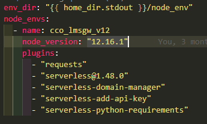
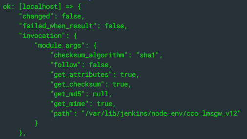
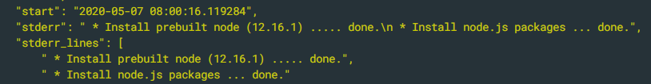

# CCO LMSGW Node Environment Deployment

## Precondition

- Verify if there are updates related to Node Environment.

  - For node version updates.
    1. Go to [devops-deployment/playbooks/roles/sharp/nodeenv-sls/defaults/main.yml](https://gitlab.sharpb2bcloud.com/ssdi-cocoro/cco-lms-gateway/-/blob/master/devops-deployment/playbooks/roles/sharp/nodeenv-sls/defaults/main.yml)

    2. Change the value of node_version.

       

       (_Note: The name "cco_lmsgw_v12" indicates the current version of the node.If an upgrade or downgrade happens, please modify the name as well, so we can identify it's version easily._)
  - If you want to use or switch to the new node environment. Please update this part of the deployment script "[deploy-cco-lmsgw-stack.sh](https://gitlab.sharpb2bcloud.com/ssdi-cocoro/cco-lms-gateway/-/blob/master/devops-deployment/scripts/deploy-cco-lmsgw-stack.sh)".
    (Ex: name: cco-lmsgw-v10)

        ............
        # activation of cco-lmsgw-v10 nodeenv

        nodeenv_dir=~/node_env/cco-lmsgw-v10
        if \[ ! -d $nodeenv\_dir \]; then
            displayError "nodeenv - not set up! Please create cco\_lmsgw nodeenv."
            exit 1
        fi
        echo -e $blue\\===Activating nodeenv===$no\_color
        source $nodeenv_dir/bin/activate

        # Check node version
        node -v
        echo "cco-lmsgw-v10 nodeenv activated!"
        ............

- Verify if there are updates related to Serverless plugins.

  - For plugins updates, you can modify the plugins list. Please refer to the main.yml image.  
    If you want to add a new plugin, just append the plugin name with or without version.

        ..............
        node_envs:
        - name: cco-lmsgw-v12
          node_version: "12.6.1"
          plugins:
           - "request"
           - "new_plugin_name"
           - "new_plugin_name2@<version>"

## Operation

1. Run this [Jenkins job](https://jenkins.sharpb2bcloud.com/job/DevOps/job/Deploy-Node-Env-CCO-LMSGW/) to deploy or update the node environment.  
   Job name: Deploy-Node-Env-CCO-LMSGW  
   Build Parameter
   - GitBranch: master

## Postcondition

- Check the console output of the job and confirm if the node environment is created.

  
- Check the console output of the job and confirm if the node version is correct.

  
