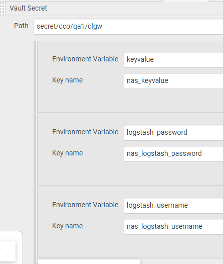
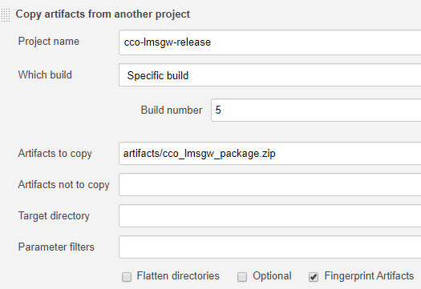
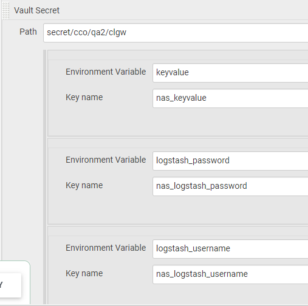
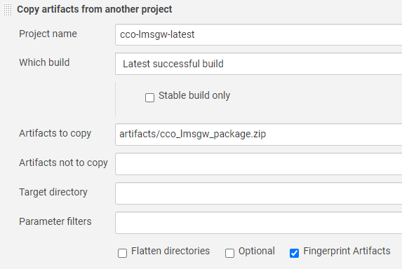
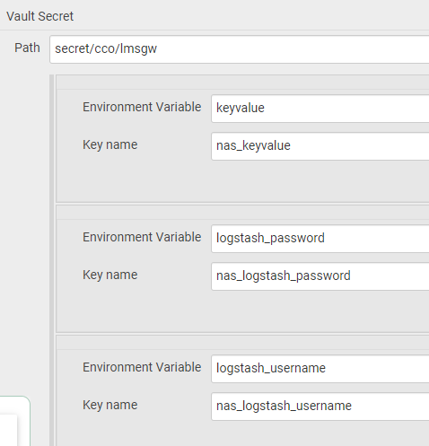
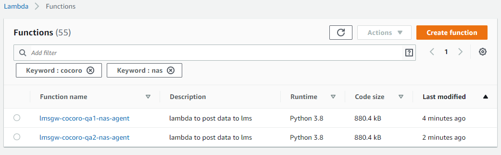
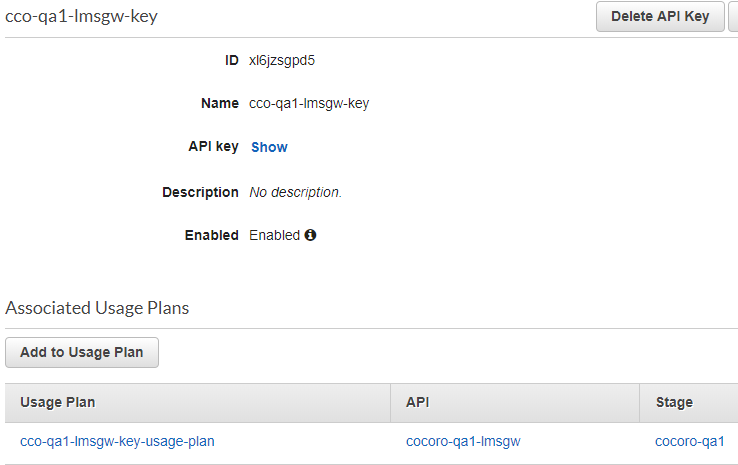

# CCO LMSGW Stack Deployment

## Precondition

- QA1
  - The node environment is installed.
  - Create a release branch based on the release tag. ( Ex: Release-v1.0 )
    - Check if there are updates in the variable file. You may refer to this [README](https://gitlab.sharpb2bcloud.com/ssdi-cocoro/cco-lms-gateway/-/blob/master/devops-deployment/variables/README.md) for the usage guidelines.
    - If the new variables need to be a secret, please add it to the [Vault](https://vault.sharpb2bcloud.com/).
      1. Login to Vault. (_Note: Credentials will be provided through Email_)
      2. Go to [cco/qa1/clgw](https://vault.sharpb2bcloud.com/ui/vault/secrets/secret/show/cco/qa1/clgw).
      3. Click the "Create new version", to add the new variable (secret).
      4. Update this [Jenkins job](https://jenkins.sharpb2bcloud.com/job/CCO-LMSGW/job/CCO-LMSGW-QA-Jobs/job/Deploy-CCO-LMSGW-qa1/), to add key/value pair of the new variable.\
      

  - Build the cco-lms-gateway artifact using the release tag.
    - Run this [Jenkins job](https://jenkins.sharpb2bcloud.com/job/CCO-LMSGW/job/CCO-LMSGW-QA-Jobs/job/Build-cco-lmsgw-release/) to build the artifact.\
      Job name: cco-lmsgw-release  
      Build Parameters:
      - refPath: refs/tags/v1.0.0
  - Update the build configuration of this [Jenkins job](https://jenkins.sharpb2bcloud.com/job/CCO-LMSGW/job/CCO-LMSGW-QA-Jobs/job/Deploy-CCO-LMSGW-qa1/) with the build.  
    Job name: Deploy-CCO-LMSGW-qa1\
    \
    _\*\*Note: It deploys the artifact built in the cco-lmsgw-release job_

- QA2

  _**Poll SCM** is enabled. It periodically checks new commits and shall build the projects if any new commits were pushed since the last build using the master branch._

  - The node environment is installed.
  - Check if there are updates in the variable file. You may refer to this [README](https://gitlab.sharpb2bcloud.com/ssdi-cocoro/cco-lms-gateway/-/blob/master/devops-deployment/variables/README.md) for the usage guidelines.
    - If the new variables need to be a secret, please add it to the [Vault](https://vault.sharpb2bcloud.com/).
      1. Login to Vault. (_Note: Credentials will be provided through Email_)
      2. Go to [cco/qa2/clgw](https://vault.sharpb2bcloud.com/ui/vault/secrets/secret/show/cco/qa2/clgw).
      3. Click the "Create new version", to add the new variable (secret).
      4. Update this [Jenkins job](https://jenkins.sharpb2bcloud.com/job/CCO-LMSGW/job/CCO-LMSGW-QA-Jobs/job/Deploy-CCO-LMSGW-qa2/), to add key/value pair of the new variable.\
      
  - Check if the [cco-lmsgw-latest](https://jenkins.sharpb2bcloud.com/job/CCO-LMSGW/job/CCO-LMSGW-QA-Jobs/job/Build-cco-lmsgw-latest/) job is using the master branch and poll scm is enabled.
  - Check if the build configuration of this [Jenkins job](https://jenkins.sharpb2bcloud.com/job/CCO-LMSGW/job/CCO-LMSGW-QA-Jobs/job/Deploy-CCO-LMSGW-qa2/) is set to copying artifacts from [cco-lmsgw-latest](https://jenkins.sharpb2bcloud.com/job/CCO-LMSGW/job/CCO-LMSGW-QA-Jobs/job/Build-cco-lmsgw-latest/).\
    Job name: Deploy-CCO-LMSGW-qa2\
      
  - Check if this [Jenkins job](https://jenkins.sharpb2bcloud.com/job/CCO-LMSGW/job/CCO-LMSGW-QA-Jobs/job/Deploy-CCO-LMSGW-qa2/) will trigger once [cco-lmsgw-latest](https://jenkins.sharpb2bcloud.com/job/CCO-LMSGW/job/CCO-LMSGW-QA-Jobs/job/Build-cco-lmsgw-latest/) is successful.

- PROD
  - The node environment is installed.
  - Create a release branch based on the release tag. ( Ex: Release-v1.0 )
    - Check if there are updates in the variable file. You may refer to this [README](https://gitlab.sharpb2bcloud.com/ssdi-cocoro/cco-lms-gateway/-/blob/master/devops-deployment/variables/README.md) for the usage guidelines.
    - If the new variables need to be a secret, please add it to the [Vault](https://vault.sharpb2bcloud.com/).
      1. Login to Vault. (_Note: Credentials will be provided through Email_)
      2. Go to [cco/lmsgw](https://vault.sharpb2bcloud.com/ui/vault/secrets/secret/show/cco/lmsgw).
      3. Click the "Create new version", to add the new variable (secret).
      4. Update this [Jenkins job](https://jenkins.sharpb2bcloud.com/job/CCO-LMSGW/job/CCO-LMSGW-QA-Jobs/job/Deploy-CCO-LMSGW-qa2/), to add key/value pair for the new variable.\
      
  - Build the cco-lms-gateway artifact using the release tag.
    - Run this [Jenkins job](https://jenkins.sharpb2bcloud.com/job/CCO-LMSGW/job/CCO-LMSGW-Prod-Jobs/job/Build-cco-lmsgw-release/) to build the artifact.  
      Job name: cco-lmsgw-release  
      Build Parameters:
      - refPath: refs/tags/v1.0.0
  - Update the build configuration of this [Jenkins job](https://jenkins.sharpb2bcloud.com/job/CCO-LMSGW/job/CCO-LMSGW-QA-Jobs/job/Deploy-CCO-LMSGW-qa1/https://jenkins.sharpb2bcloud.com/job/CCO-LMSGW/job/CCO-LMSGW-Prod-Jobs/job/Deploy-CCO-LMSGW-prod/) with the build.\
    Job name: Deploy-CCO-LMSGW-prod\
      \
    _\*\*Note: It deploys the artifact built in the cco-lmsgw-release job_

## Operation

- QA1

  Run this [Jenkins job](https://jenkins.sharpb2bcloud.com/job/CCO-LMSGW/job/CCO-LMSGW-QA-Jobs/job/Deploy-CCO-LMSGW-qa1/) to deploy QA1.  
  Job name: Deploy-CCO-LMSGW-qa1  
  Build Number:
  Build Parameters:
  - StackName: cco-lmsgw-qa1
  - GitBranch: Release-v1.0
  - Check: CreateDomain
  - Check: DeployNasAgent  
    _\*\*Note: CreationDomain is a one-time deployment only._

- QA2

  _**Poll SCM** is enabled. It periodically checks new commits and shall build the projects if any new commits were pushed since the last build using the master branch._

  Run this [Jenkins job](https://jenkins.sharpb2bcloud.com/job/CCO-LMSGW/job/CCO-LMSGW-QA-Jobs/job/Deploy-CCO-LMSGW-qa2/) to deploy QA2.  
  Job name: Deploy-CCO-LMSGW-qa2  
  Build Number:
  Build Parameters:
  - StackName: cco-lmsgw-qa2
  - GitBranch: master
  - Uncheck: CreateDomain
  - Check: DeployNasAgent

- Prod

  Run this [Jenkins job](https://jenkins.sharpb2bcloud.com/job/CCO-LMSGW/job/CCO-LMSGW-Prod-Jobs/job/Deploy-CCO-LMSGW-prod/) to deploy PROD.  
  Job name: Deploy-CCO-LMSGW-prod  
  Build Number:
  Build Parameters:
  - StackName: cco-lmsgw-prod
  - GitBranch: Release-v1.0
  - Check: CreateDomain
  - Check: DeployNasAgent  
    _\*\*Note: CreationDomain is a one-time deployment only._

## Postcondition

- Check if Lambda functions are created.
  1. Go to AWS Console.
  2. In Services, type "Lambda" then click.
  3. In Function, use the filter then type the keyword. (Ex: cocoro, nas)\
  

- Check if API Keys are generated.
  1. Go to AWS Console.
  2. In Services, type "API Gateway" then click.
  3. Search for API name then click.
  4. Go to API Keys, search the key name.\
  

- Confirm API Endpoint via Postman.
  - QA

    - stack:  
      \* qa1  
      \* qa2

    - api-key:  
      For the values, please refer to this [page](https://confluence.sharpb2bcloud.in/display/BSTCOD/COCORO+Stacks).

          POST /<stack>-lmsgw-v1/nas-agent/api/v1/data HTTP/1.1
          Host: cco-api.sharpb2bcloud.com
          x-api-key: <api-key>
          Cache-Control: no-cache
          Content-Type: application/json
          Postman-Token: c33720bd-0d79-068f-4668-9c85e9f3265f

          {
          "operationType": "NASInformation",
          "schema": "cocoro_sspagent_nasfile_v1",
          "stack": "ssp-devco",
          "used_storage_size": "6892M",
          "avail_storage_size": "21665M",
          "tenant_id": "123456789",
          "device_id": "6084bdc00237",
          "log_time": "2020-03-17T06:15:41Z",
          "hardware_type": "1.60-21121211",
          "number_of_total_files": 76317,
          "shared_folder": \[
          {
          "foldername": "abc",
          "number": 24
          },
          {
          "foldername": "def",
          "number": 66
          },
          {
          "foldername": "xyz",
          "number": 2
          },
          {
          "foldername": "share",
          "number": 59447
          },
          {
           "foldername": "share2",
          "number": 15785
          },
          {
          "foldername": "share3",
          "number": 0
          },
          {
          "foldername": "spool",
          "number": 960
          }
          \]
          }

  - PROD
    - api-key:  
      For the values, please refer to this [page](https://confluence.sharpb2bcloud.in/display/BSTCOD/COCORO+Stacks).

          POST /lmsgw-v1/nas-agent/api/v1/data HTTP/1.1
          Host: cco-api.sharpbscloud.com
          x-api-key: <api-key>
          Cache-Control: no-cache
          Content-Type: application/json
          Postman-Token: e665b70f-4670-c969-47f9-549fcb1fa2cd

          {
          "operationType": "NASInformation",
          "schema": "cocoro_sspagent_nasfile_v1",
          "stack": "ssp-prodco",
          "used_storage_size": "6892M",
          "avail_storage_size": "21665M",
          "tenant_id": "123456789",
          "device_id": "6084bdc00237",
          "log_time": "2020-06-10T06:15:41Z",
          "hardware_type": "1.60-21121211",
          "number_of_total_files": 76317,
          "shared_folder": \[
          {
          "foldername": "abc",
           "number": 24
          },
          {
           "foldername": "def",
           "number": 66
          },
          {
           "foldername": "xyz",
           "number": 2
          },
          {
          "foldername": "share",
          "number": 59447
          },
          {
          "foldername": "share2",
          "number": 15785
          },
          {
          "foldername": "share3",
          "number": 0
          },
          {
          "foldername": "spool",
          "number": 960
          }
          \]
          }
